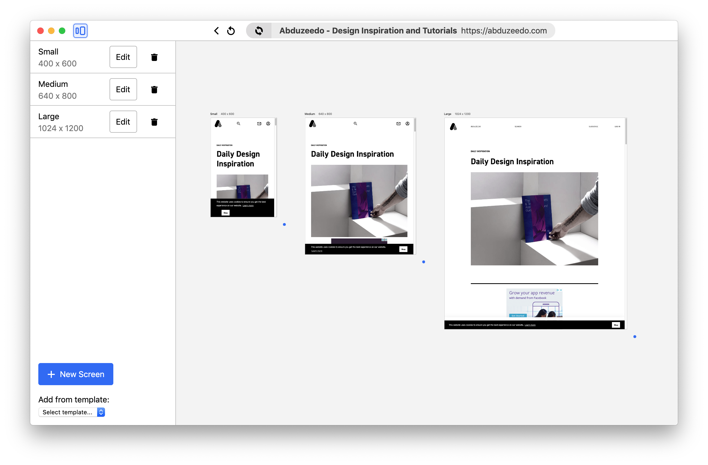

# Boomerang for Mac
Easily keep an eye on prices and other static/dynamic values from any website.

## Running Boomerang
### Normal
- Download the latest release: https://github.com/nwittwer/boomerang-for-mac/releases
- Move the Application to your Applications folder
    - If you get a warning like "Cannot be opened because the developer is not verified.", open System Preferences > Security & Privacy > "Open anyway"
- Open the application by double-clicking it

### No GUI (Terminal only)
- Open your project folder and open the `app` folder
- Double-click "ba.sh.command" file
- Open `http://localhost:8000` in your browser
- In Terminal, you can hit CTRL + C to end the process

## Using the App
- When you open the app, you'll notice a starter template of results. This is to give you an idea of how you might use the app.
- To add/edit/delete items, click on "Edit" in the top left. In the Edit mode, you can add new items, re-arrange the position of items by dragging-and-dropping, and edit/delete. Clicking on an item will reveal its setup, and the ability to delete it.
    - There's a few settings to understand the app:
        - Goal Type
            - Are you hoping to return a number, text, or an image?
        - Goal Value
            - If you selected a number, what value do you want it to be above/below?
        - URL
            - What is the web page you want to keep an eye on? Ex: `http://apple.com`
        - CSS
            - What is the unique ID or class of the element you're looking for? This can be found by right-clicking the website > Inspect. Then right click the element > Copy > Copy selector. Sometimes you have to get creative—if it's a list of items, you can use something like `.list-class:nth-child(1)` to just get the first item.
- To run the main function (searching websites), click the sync icon next to "Edit" in the top left. You'll see a progress indicator, and will be notified if there's any issue finding the CSS element. You'll also receive a notification once it has completed.

## FAQ
- `Error: listen EADDRINUSE :::8000` --> Run this in Terminal: `kill -9 $(lsof -i TCP:8000 | grep LISTEN | awk '{print $2}')`
- If you get something like "Your profile can not be used because it is from a newer version of NW.js." run this: `rm -R ~/Library/Application\ Support/Boomerang`
- This project has the ability to build for Windows, but currently only the Mac version is being supported/tested

## How it works
1. NWJS launches the Node web app inside of a native wrapper, making it appear like a native Mac app
2. Once launched, a Node server is created, and NWJS allows us to access Node Modules
3. When someone clicks on the sync icon, the app will go through a list of sites (JSON)
4. For each site, Puppeteer creates a Chromium tab and searches the DOM for a CSS element
5. The values it finds will be displayed on the main screen of the app.
6. You can configure more websites by clicking "Edit" in the top right.

## Developing
Requirements:
• Node 8.0+
• NPM 5+
• Gulp 4+

1. Clone this repo
2. `cd` into the `src` directory and run `npm install` to install the dev tools
3. `cd` into the `src/app` directory and run `npm install` to install the app modules
4. If you want to run the app in development, use `gulp run-app`. If you want to load it in the browser (which isn't very useful, since Puppeteer won't work) run `gulp`, and you'll see a local server at `http://localhost:3000`. SCSS, JS, and images will be watched and updated upon saving.
6. To compile the app, run `gulp build-app`. The build is stored under `src/build`.

## Debugging
- With the app running, go to `http://localhost:9999` and select the background page task to view the Node errors.
